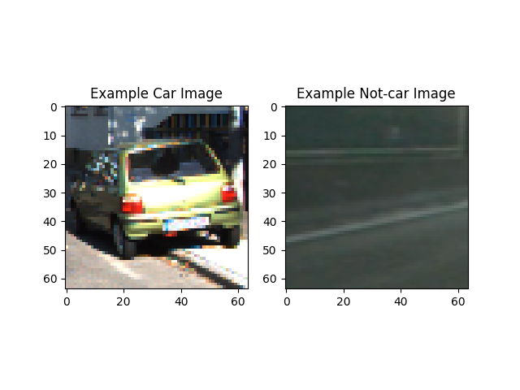
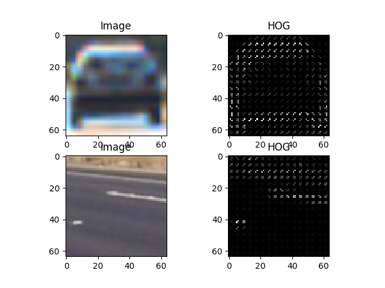
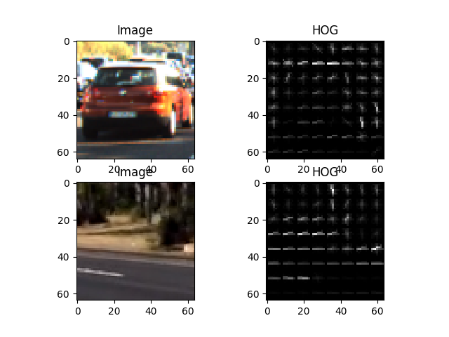
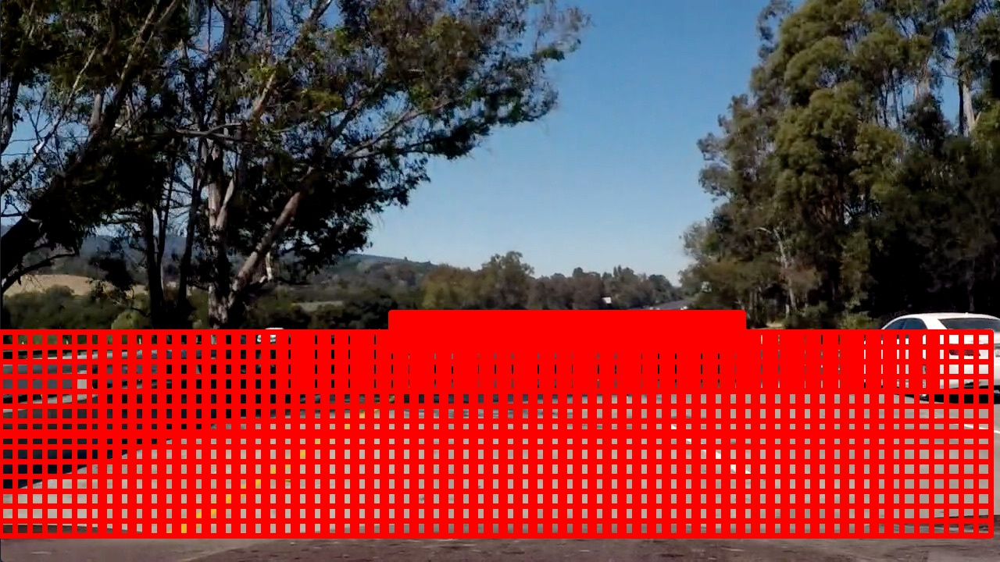
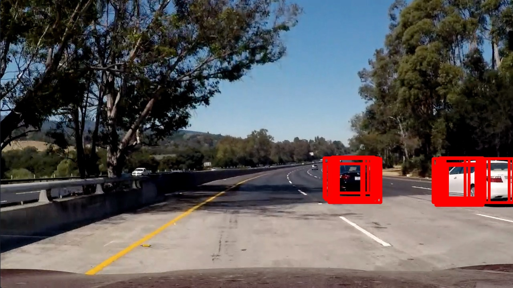
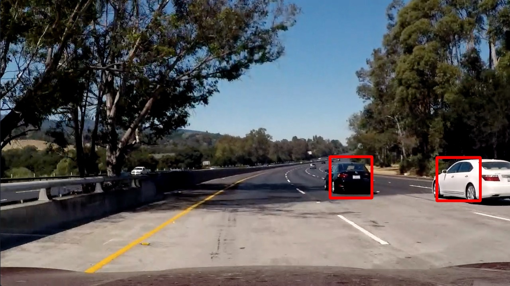

**Vehicle Detection Project**

The goals of this project are the following:
* Perform a Histogram of Oriented Gradients (HOG) feature extraction on a labeled training set of images and train a classifier Linear SVM classifier
* Apply a color transform and append binned color features, as well as histograms of color, to the HOG feature vector. 
* Implement a sliding-window technique and use the trained classifier to search for vehicles in images.
* Run pipeline on a video stream and create a heat map of recurring detections frame by frame to reject outliers and follow detected vehicles.
* Estimate a bounding box for vehicles detected.

[//]: # (Image References)
[image1]: ./examples/car_not_car.png
[image2]: ./examples/HOG_example.jpg
[image3]: ./examples/sliding_windows.jpg
[image4]: ./examples/sliding_window.jpg
[image5]: ./examples/bboxes_and_heat.png
[image6]: ./examples/labels_map.png
[image7]: ./examples/output_bboxes.png
[video1]: ./project_video.mp4

###Histogram of Oriented Gradients (HOG)

####1. HOG features extraction:

The HOG features are extracted in the `extractHOG(img, orient, pix_per_cell, cell_per_block, feature_vec=True)` function which is used in the `extractFeatures(img)` function in the `project5.py`. 
At first I used the sklearn hog function for a better understanding of the parameter:
```python
        features, hog_image = hog(img, orientations=orient, pixels_per_cell=(pix_per_cell, pix_per_cell),
                                  cells_per_block=(cell_per_block, cell_per_block), transform_sqrt=False, 
                                  visualise=True, feature_vector=False)
```
For the final version HOG features are extracted using OpenCV HOG-Function with the following parameters
```python
        hog = cv2.HOGDescriptor((64,64), (8,8), (8,8), (8,8), 9)
        features = hog.compute(img)
```
I compared the YCrCb and the YUV color space and compared the accuracy using a SVM-Model. Then I chosed to use the YCrCb color space.
Subsequently, I loaded the images from the udacity `vehicle` and `non-vehicle` dataset. With 8792 and 8969 samples, they are almost symmetric and do not need any modifications.
The filenames are extracted using the `loadTrainingData()` function and loaded by the `prepareTrainingData()` function.
```python
def loadTrainingData():
    vehicle_images_udacity = glob.glob('test_data/vehicles/*/*.png')
    nonvehicle_images_udacity = glob.glob('test_data/non-vehicles/*/*.png')
    cars = vehicle_images_udacity
    notcars = nonvehicle_images_udacity
    return cars,notcars
    
def prepareTrainingData(cars,notcars):
    print(len(cars))
    print(len(notcars))
    X=[]
    y=[]

    for car in cars:
        car_image = cv2.imread(car)
        X_temp = extractFeatures(car_image)
        y_temp = 1
        X.append(X_temp)
        y.append(y_temp)
    for notcar in notcars:
        notcar_image = cv2.imread(notcar)
        X_temp = extractFeatures(notcar_image)
        y_temp = 0
        X.append(X_temp)
        y.append(y_temp)
    return X,y
```

Here is an example of one of each of the `vehicle` and `non-vehicle` classes which is plotted using the `plotRandomPair(cars,notcars)` function:
 

I tried different parameters for the `skimage.hog()` function(`orientations`, `pixels_per_cell`, and `cells_per_block`). I plotted several different parameters using the function `plotHOGParameterset(cars,notcars,orient, pix_per_cell, cell_per_block)`.
```python
def plotHOGParameterset(cars,notcars,orient, pix_per_cell, cell_per_block):
    notcar_ind = randint(0, len(notcars))
    car_ind = randint(0, len(cars))
    car_image = mpimg.imread(cars[car_ind])
    notcar_image = mpimg.imread(notcars[notcar_ind])

    car_image_gray = cv2.cvtColor(car_image, cv2.COLOR_RGB2GRAY)
    notcar_image_gray = cv2.cvtColor(notcar_image, cv2.COLOR_RGB2GRAY)

    features,car_image_hog = extractHOG(car_image_gray, orient, pix_per_cell, cell_per_block, True, False)
    features,notcar_image_hog = extractHOG(notcar_image_gray, orient, pix_per_cell, cell_per_block, True, False)

    fig = plt.figure()
    plt.subplot(221)
    plt.imshow(car_image, cmap='gray')
    plt.title('Image')

    plt.subplot(222)
    plt.imshow(car_image_hog, cmap='gray')
    plt.title('HOG')

    plt.subplot(223)
    plt.imshow(notcar_image, cmap='gray')
    plt.title('Image')

    plt.subplot(224)
    plt.imshow(notcar_image_hog, cmap='gray')
    plt.title('HOG')

    plt.savefig('output_images/example_hog.png')
```
Here are some examples:

Parameters `orient=9` `pix_per_cell=4` `cell_per_block=2`
 
Parameters `orient=12` `pix_per_cell=8` `cell_per_block=4`
 

Finally, I used the OpenCV HOG function for performance issues on a 64,64 image patch

####2. Final choice of HOG parameters.

I trained a (Support Vector Machine) SVM only based on the HOG features and evaluated the performance using the `evaluateModel(X_test,y_test,clf)` function. 

```python
def evaluateModel(X_test,y_test,clf):
    y_predict = clf.predict(X_test)
    accuracy = accuracy_score(y_predict, y_test)
    return accuracy
```

I then used the parameterset for the HOG features, which provided the best accuracy for the test dataset. Then I added HOC to improve the accuracy on the test dataset further.
`orient=9` `pix_per_cell=4` `cell_per_block=2` `accuracy=88.93`
`orient=12` `pix_per_cell=8` `cell_per_block=4` `accuracy=50.74`
...

The parameter I ended up with are:
`orient=9` `pix_per_cell=4` `cell_per_block=2`

####3. Classifier Training

I trained a linear SVM using a feature vector consisting of the HOG and color histogram using GridSearch for parameterizing as shown below.

```python
def trainClassifier(X,y):
    parameters = {'kernel':('linear', 'rbf'), 'C':[1, 10]}
    svr = svm.SVC()
    clf = grid_search.GridSearchCV(svr, parameters)
    clf.fit(X, y)
    return clf
```
The resulting accuracy is 98.73%

###Sliding Window Search

####1. Sliding Window Search

I search the botom half of the image in three stages. The smalles window is slided across the horizon region. The other second stages have a bigger window size and are slieded in lower regions of the image, where cars will appear bigger.
The following image shows the different regions:



The bigger the expected size of the car is, the smaller I chosed the overlapping window.

####2. Pipeline Demonstration

For every image generated by the window search I performed feature extraction (using HOG and HOC (color histogram)). I then performed normalization and applied the trained model. As mentioned before, I used gridSearch to determine the parameter and tried different color spaces. The performance has been evaluated looking at the accuracy
With a array of 64x64 sized windows which are classified as`1`, I generated a heat map. This headmap is threshholded and finally labeled.
Here are some images:
All detected cars using the window sliding apporach:
 
And here is the final image after generating the heatmap, threshholding and labeling:
 

Here is the code of the pipeline:
```python
def detect_vehicles_video(img):
    previousDetections = []
    detections = detectVehicles(img, clf, X_scaler, previousDetections)
    heat = np.zeros_like(image[:,:,0]).astype(np.float)
    heat = add_heat(heat, detections)
    heat = apply_threshold(heat, 1.0)
    heatmap = np.clip(heat, 0, 255)
    labels = label(heatmap)
    label_image = draw_labeled_bboxes(np.copy(image), labels)
    return label_image
```

```python
def detectVehicles(img, model, X_scaler, previousDetections):
    detectionBoxes = []
    #Sliding Window
    #Horizon Region
    print('1. Detection Stage')
    windows = slide_window(img, x_start_stop=[500, 950], y_start_stop=[400, 450], xy_window=(25, 25), xy_overlap=(0.85, 0.85))
    for window in windows:
        window_extract = img[window[0][1]:window[1][1],window[0][0]:window[1][0]]
        test_window = cv2.resize(window_extract,(64,64))
        prediction = predict(test_window,model,X_scaler)
        #print(prediction)
        if prediction==1:
            print('Vehicle Detected')
            detectionBoxes.append(window)


    print('2. Detection Stage')
    windows = slide_window(img, x_start_stop=[365, 1200], y_start_stop=[425, 500], xy_window=(75, 75), xy_overlap=(0.75, 0.75))
    for window in windows:
        window_extract = img[window[0][1]:window[1][1],window[0][0]:window[1][0]]
        test_window = cv2.resize(window_extract,(64,64))
        prediction = predict(test_window,model,X_scaler)
        if prediction==1:
            print('Vehicle Detected')
            detectionBoxes.append(window)

    print('3. Detection Stage')
    windows = slide_window(img, x_start_stop=[None, None], y_start_stop=[425, 700], xy_window=(128, 128), xy_overlap=(0.65, 0.65))
    for window in windows:
        window_extract = img[window[0][1]:window[1][1],window[0][0]:window[1][0]]
        test_window = cv2.resize(window_extract,(64,64))
        prediction = predict(test_window,model,X_scaler)
        if prediction==1:
            print('Vehicle Detected')
            detectionBoxes.append(window)
    print('Detection finished')
    return detectionBoxes
```
---

### Video Implementation

####1. Filtering
Besides the heatmap and labeling filtering described earlier in this writeup. I added a fitler which checks regions in which a vehicle has been detected in the previous frame with more detail. 
Therefore, I checked the last 3 heatmaps of the video to track the vehicles smoother and make the detection more robust against outlier:


Besides as explaines earlier: I recorded the positions of positive detections in each frame of the video.  From the positive detections I created a heatmap and then thresholded that map to identify vehicle positions.  I then used `scipy.ndimage.measurements.label()` to identify individual blobs in the heatmap.  I then assumed each blob corresponded to a vehicle.  I constructed bounding boxes to cover the area of each blob detected.  

```python
def detect_vehicles_video(img):
    previousDetections = []
    detections = detectVehicles(img, clf, X_scaler, previousDetections)
    heat = np.zeros_like(img[:,:,0]).astype(np.float)
    heat = add_heat(heat, detections)

    heatmaps.append(heat)
    combined = np.sum(heatmaps, axis=0)

    heat = apply_threshold(combined, 4)
    heatmap = np.clip(heat, 0, 255)

    labels = label(heatmap)
    label_image = draw_labeled_bboxes(np.copy(img), labels)
    return label_image
```
---

###Discussion

My current approach does not consider any motion model for the vehicles which could be used to set an initial searching area for an already tracked vehicle. Additional, no sophisticated initial step for setting initial regions of interests is implemented like optical flow. The dataset for training could be increased further to make the detection more robust. It has to be researched, if the SVM ist the best model for this applications. Maybe, a convnet would be better for this task.
Vehicles not included in the dataset will probably not be detected on the street. Another drawback ist the bad performance time, which could be further optimized (vehicle tracking, observing vehicle movement etc.).
